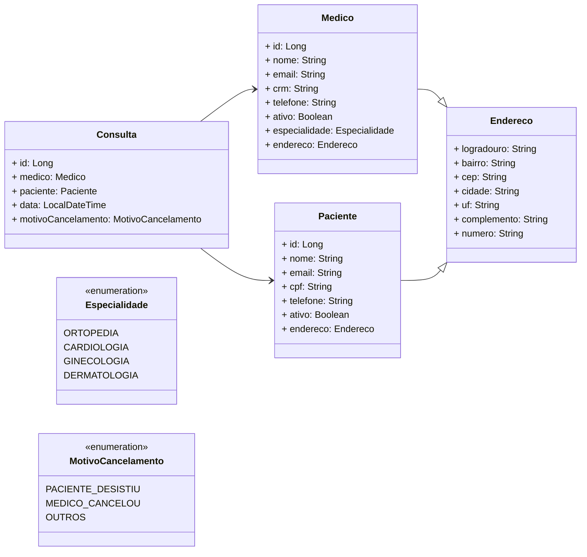

<h1 align=center>MedVoll</h1>

<h2>Descrição</h2>
<ul class="list">
    <li>➡️ Nome</li>
    <li>➡️ E-mail</li>
    <li>➡️ CRM</li>
    <li>➡️ Especialidade (Ortopedia, Cardiologia, Ginecologia ou Dermatologia)</li>
    <li>➡️ Endereço completo (logradouro, número, complemento, bairro, cidade, UF e CEP)</li>
</ul>

<h2>Funcionalidade de Listagem de Médicos</h2>

O sistema deve possuir uma funcionalidade de listagem de médicos, na qual as seguintes informações, de cada um dos médicos cadastrados, deverão ser exibidas:

<ul class="list">
    <li>➡️ Nome</li>
    <li>➡️ E-mail</li>
    <li>➡️ CRM</li>
    <li>➡️ Especialidade</li>
</ul>

A listagem deve ser ordenada pelo nome do médico, de maneira crescente, bem como ser paginada, trazendo 10 registros por página.

<h2>Funcionalidade de Atualização de Dados Cadastrais de Médicos</h2>

O sistema deve possuir uma funcionalidade de atualização de dados cadastrais de médicos, na qual as seguintes informações poderão ser atualizadas:

<ul class="list">
    <li>➡️ Nome</li>
    <li>➡️ Telefone</li>
    <li>➡️ Endereço</li>
</ul>

As seguintes regras de negócio devem ser validadas pelo sistema:

<ul class="list">
    <li>➡️ Não permitir a alteração do e-mail do médico;</li>
    <li>➡️ Não permitir a alteração do CRM do médico;</li>
    <li>➡️ Não permitir a alteração da Especialidade do médico.</li>
</ul>

<h2>Funcionalidade de Exclusão de Médicos</h2>

O sistema deve possuir uma funcionalidade que permita a exclusão de médicos cadastrados.

As seguintes regras de negócio devem ser validadas pelo sistema:

<ul class="list">
    <li>➡️ A exclusão não deve apagar os dados do médico, mas torná-lo como "inativo" no sistema.</li>
</ul>

<h2>Descrição</h2>
<ul class="list">
    <li>➡️ Nome</li>
    <li>➡️ E-mail</li>
    <li>➡️ Telefone</li>
    <li>➡️ CPF</li>
    <li>➡️ Endereço completo (logradouro, número, complemento, bairro, cidade, UF e CEP)</li>
</ul>

<h2>Funcionalidade de Listagem de Pacientes</h2>

O sistema deve possuir uma funcionalidade de listagem de pacientes, na qual as seguintes informações, de cada um dos pacientes cadastrados, deverão ser exibidas:

<ul class="list">
    <li>➡️ Nome</li>
    <li>➡️ E-mail</li>
    <li>➡️ CPF</li>
</ul>

A listagem deve ser ordenada pelo nome do paciente, de maneira crescente, bem como ser paginada, trazendo 10 registros por página.

<h2>Funcionalidade de Atualização de Dados Cadastrais de Pacientes</h2>

O sistema deve possuir uma funcionalidade de atualização de dados cadastrais de pacientes, na qual as seguintes informações poderão ser atualizadas:

<ul class="list">
    <li>➡️ Nome</li>
    <li>➡️ Telefone</li>
    <li>➡️ Endereço</li>
</ul>

As seguintes regras de negócio devem ser validadas pelo sistema:

<ul class="list">
    <li>➡️ Não permitir a alteração do e-mail do paciente;</li>
    <li>➡️ Não permitir a alteração do CPF do paciente.</li>
</ul>

<h2>Funcionalidade de Exclusão de Pacientes</h2>

O sistema deve possuir uma funcionalidade que permita a exclusão de pacientes cadastrados.

As seguintes regras de negócio devem ser validadas pelo sistema:

<ul class="list">
    <li>➡️ A exclusão não deve apagar os dados do paciente, mas torná-lo como "inativo" no sistema.</li>
</ul>

<h2>Funcionalidade de Agendamento de Consultas</h2>

O sistema deve possuir uma funcionalidade que permita o agendamento de consultas, na qual as seguintes informações deverão ser preenchidas:

<ul class="list">
    <li>➡️ Paciente</li>
    <li>➡️ Médico</li>
    <li>➡️ Data/Hora da consulta</li>
</ul>

As seguintes regras de negócio devem ser validadas pelo sistema:

<ul class="list">
    <li>➡️ O horário de funcionamento da clínica é de segunda a sábado, das 07:00 às 19:00;</li>
    <li>➡️ As consultas têm duração fixa de 1 hora;</li>
    <li>➡️ As consultas devem ser agendadas com antecedência mínima de 30 minutos;</li>
    <li>➡️ Não permitir o agendamento de consultas com pacientes inativos no sistema;</li>
    <li>➡️ Não permitir o agendamento de consultas com médicos inativos no sistema;</li>
    <li>➡️ Não permitir o agendamento de mais de uma consulta no mesmo dia para um mesmo paciente;</li>
    <li>➡️ Não permitir o agendamento de uma consulta com um médico que já possui outra consulta agendada na mesma data/hora;</li>
    <li>➡️ A escolha do médico é opcional, sendo que nesse caso o sistema deve escolher aleatoriamente algum médico disponível na data/hora preenchida.</li>
</ul>

<h2>Funcionalidade de Cancelamento de Consultas</h2>

O sistema deve possuir uma funcionalidade que permita o cancelamento de consultas, na qual as seguintes informações deverão ser preenchidas:

<ul class="list">
    <li>➡️ Consulta</li>
    <li>➡️ Motivo do cancelamento</li>
</ul>

As seguintes regras de negócio devem ser validadas pelo sistema:

<ul class="list">
    <li>➡️ É obrigatório informar o motivo do cancelamento da consulta, dentre as opções: paciente desistiu, médico cancelou ou outros;</li>
    <li>➡️ Uma consulta somente poderá ser cancelada com antecedência mínima de 24 horas.</li>
</ul>

> ⚠️ OBS: Todas as informações são de preenchimento obrigatório, exceto o número e o complemento do endereço.
