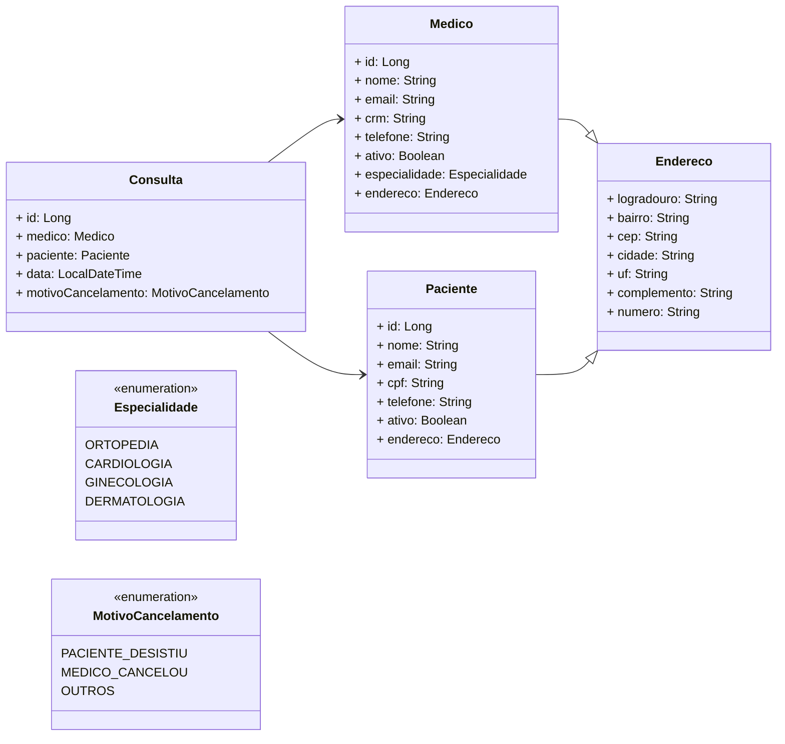

<h1 align=center>MedVoll ⚕️</h1>

Uma clínica médica fictícia que precisa de um aplicativo para gestão de consultas. O aplicativo deve possuir funcionalidades que permitam o cadastro de médicos e de pacientes, e também o agendamento e cancelamento de consultas.

## Índice

1. [Diagrama de Classe](#diagrama-de-classe)
2. [Cadastro de Médicos](#cadastro-de-médicos)
3. [Funcionalidade de Listagem de Médicos](#funcionalidade-de-listagem-de-médicos)
4. [Funcionalidade de Atualização de Dados Cadastrais de Médicos](#funcionalidade-de-atualização-de-dados-cadastrais-de-médicos)
5. [Funcionalidade de Exclusão de Médicos](#funcionalidade-de-exclusão-de-médicos)
6. [Funcionalidade de Listagem de Pacientes](#funcionalidade-de-listagem-de-pacientes)
7. [Funcionalidade de Atualização de Dados Cadastrais de Pacientes](#funcionalidade-de-atualização-de-dados-cadastrais-de-pacientes)
8. [Funcionalidade de Exclusão de Pacientes](#funcionalidade-de-exclusão-de-pacientes)
9. [Funcionalidade de Agendamento de Consultas](#funcionalidade-de-agendamento-de-consultas)
10. [Funcionalidade de Cancelamento de Consultas](#funcionalidade-de-cancelamento-de-consultas)
11. [Ferramentas](#ferramentas)

---

## Diagrama de Classe

## Cadastro de Médicos

O sistema deve possuir uma funcionalidade de cadastro de médicos, na qual as seguintes informações deverão ser preenchidas:

- ➡️ Nome
- ➡️ E-mail
- ➡️ CRM
- ➡️ Especialidade (Ortopedia, Cardiologia, Ginecologia ou Dermatologia)
- ➡️ Endereço completo (logradouro, número, complemento, bairro, cidade, UF e CEP)

## Funcionalidade de Listagem de Médicos

O sistema deve possuir uma funcionalidade de listagem de médicos, na qual as seguintes informações, de cada um dos médicos cadastrados, deverão ser exibidas:

- ➡️ Nome
- ➡️ E-mail
- ➡️ CRM
- ➡️ Especialidade

⚠️ Obs: A listagem deve ser ordenada pelo nome do médico, de maneira crescente, bem como ser paginada, trazendo 10 registros por página.

## Funcionalidade de Atualização de Dados Cadastrais de Médicos

O sistema deve possuir uma funcionalidade de atualização de dados cadastrais de médicos, na qual as seguintes informações poderão ser atualizadas:

- ➡️ Nome
- ➡️ Telefone
- ➡️ Endereço

As seguintes regras de negócio devem ser validadas pelo sistema:

- ➡️ Não permitir a alteração do e-mail do médico;
- ➡️ Não permitir a alteração do CRM do médico;
- ➡️ Não permitir a alteração da Especialidade do médico.

## Funcionalidade de Exclusão de Médicos

O sistema deve possuir uma funcionalidade que permita a exclusão de médicos cadastrados.

As seguintes regras de negócio devem ser validadas pelo sistema:

- ➡️ A exclusão não deve apagar os dados do médico, mas torná-lo como "inativo" no sistema.

## Funcionalidade de Listagem de Pacientes

O sistema deve possuir uma funcionalidade de listagem de pacientes, na qual as seguintes informações, de cada um dos pacientes cadastrados, deverão ser exibidas:

- ➡️ Nome
- ➡️ E-mail
- ➡️ CPF

A listagem deve ser ordenada pelo nome do paciente, de maneira crescente, bem como ser paginada, trazendo 10 registros por página.

## Funcionalidade de Atualização de Dados Cadastrais de Pacientes

O sistema deve possuir uma funcionalidade de atualização de dados cadastrais de pacientes, na qual as seguintes informações poderão ser atualizadas:

- ➡️ Nome
- ➡️ Telefone
- ➡️ Endereço

As seguintes regras de negócio devem ser validadas pelo sistema:

- ➡️ Não permitir a alteração do e-mail do paciente;
- ➡️ Não permitir a alteração do CPF do paciente.

## Funcionalidade de Exclusão de Pacientes

O sistema deve possuir uma funcionalidade que permita a exclusão de pacientes cadastrados.

As seguintes regras de negócio devem ser validadas pelo sistema:

- ➡️ A exclusão não deve apagar os dados do paciente, mas torná-lo como "inativo" no sistema.

## Funcionalidade de Agendamento de Consultas

O sistema deve possuir uma funcionalidade que permita o agendamento de consultas, na qual as seguintes informações deverão ser preenchidas:

- ➡️ Paciente
- ➡️ Médico
- ➡️ Data/Hora da consulta

As seguintes regras de negócio devem ser validadas pelo sistema:

- ➡️ O horário de funcionamento da clínica é de segunda a sábado, das 07:00 às 19:00;
- ➡️ As consultas têm duração fixa de 1 hora;
- ➡️ As consultas devem ser agendadas com antecedência mínima de 30 minutos;
- ➡️ Não permitir o agendamento de consultas com pacientes inativos no sistema;
- ➡️ Não permitir o agendamento de consultas com médicos inativos no sistema;
- ➡️ Não permitir o agendamento de mais de uma consulta no mesmo dia para um mesmo paciente;
- ➡️ Não permitir o agendamento de uma consulta com um médico que já possui outra consulta agendada na mesma data/hora;
- ➡️ A escolha do médico é opcional, sendo que nesse caso o sistema deve escolher aleatoriamente algum médico disponível na data/hora preenchida.

## Funcionalidade de Cancelamento de Consultas

O sistema deve possuir uma funcionalidade que permita o cancelamento de consultas, na qual as seguintes informações deverão ser preenchidas:

- ➡️ Consulta
- ➡️ Motivo do cancelamento

As seguintes regras de negócio devem ser validadas pelo sistema:

- ➡️ É obrigatório informar o motivo do cancelamento da consulta, dentre as opções: paciente desistiu, médico cancelou ou outros;
- ➡️ Uma consulta somente poderá ser cancelada com antecedência mínima de 24 horas.

## Ferramentas

<table align="center" width=1000px>
    <thead>
        <tr>
            <th></th>
            <th></th>
            <th></th>
            <th></th>
	          <th></th>
        </tr>
    </thead>
    <tbody align="center">
        <tr>
            <td>Spring Boot</td>
            <td>Java</td>
            <td>MySQL</td>
            <td>VSCode</td>
	          <td>Postman</td>
        </tr>
        <tr>
            <td>🔖 3.0.0</td>
            <td>🔖 17</td>
            <td>🔖 8.1.0</td>
            <td>🔖 1.82</td>
	          <td>🔖 10.19</td>
        </tr>
    </tbody>
</table>

